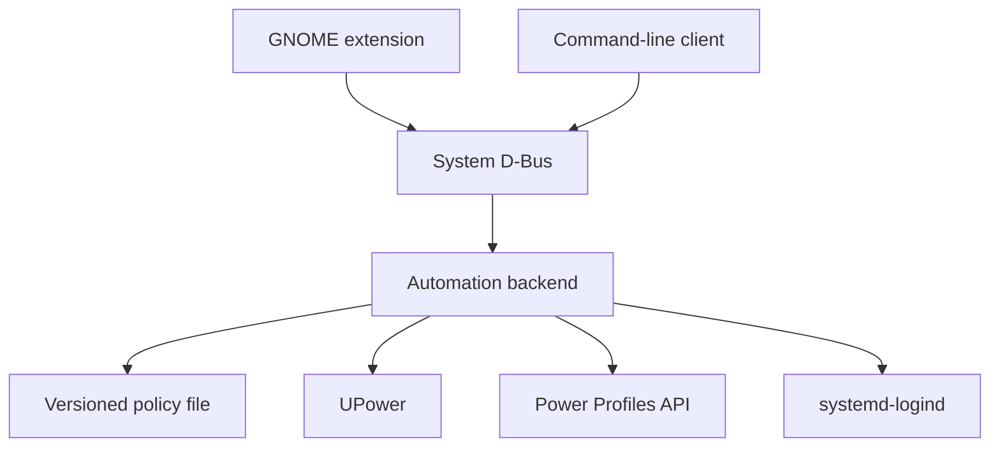

# Target architecture and privilege model

Status: target contract with rollout steps 1 and 2 implemented.

This document defines the component boundaries that implementation pull
requests must preserve. The read-only backend is available alongside the
legacy Bash monitor; mutation and monitor ownership have not moved yet.

The corresponding public D-Bus contract is specified in
[`dbus-api-v1.md`](dbus-api-v1.md).

## Goals

- Keep one system component responsible for applying power and lid policy.
- Let the CLI and a future GNOME extension operate without running as root.
- Put every privileged mutation behind a narrow, typed, versioned interface.
- Preserve the existing AC, battery, low-battery, and lid-close semantics.
- Continue using Fedora's existing UPower, Power Profiles, TuneD, and logind
  stack rather than introducing another hardware-tuning engine.
- Make each layer independently reviewable and testable.

## Non-goals

- Replacing TuneD, `tuned-ppd`, UPower, or systemd-logind.
- Direct CPU, platform, storage, radio, or device tuning.
- Letting a GNOME extension edit files under `/etc` or invoke `systemctl`.
- Running privileged code in the GNOME Shell process.
- Supporting per-user policies in D-Bus API version 1. Policy remains
  system-wide.
- Adding network access, accounts, telemetry, or remote control.

## Current and target boundaries

The current executable performs user interaction, configuration persistence,
system inspection, policy decisions, and privileged mutations in one root-owned
process. That remains supported until the target backend replaces it.

The target design separates unprivileged clients from one privileged backend:

The backend is the only runtime policy authority. Clients express intent through
D-Bus and never reproduce the policy state machine or perform privileged work.

## Component responsibilities

| Component | Runs as | Responsibilities | Must not do |
|---|---|---|---|
| Backend service | `root` system service | Own configuration, observe UPower, evaluate policy, set the Power Profiles property, manage the logind drop-in, publish state | Render interactive UI, trust client validation, access the network |
| CLI | Calling user | Display status, collect terminal input, call the backend, explain errors | Edit managed files, call `systemctl`, set the Power Profiles property |
| GNOME extension | Desktop user inside GNOME Shell | Display state, provide preferences, call the backend, react to signals | Spawn privileged commands, edit `/etc`, manage services, implement a second monitor |
| Installer and uninstaller | Explicitly invoked as `root` | Install packages and service metadata, perform one-time migration, enable or remove services | Act as the normal configuration interface |
| UPower | Existing system service | Publish charger, battery, percentage, and warning state | Know project configuration |
| Power Profiles provider | Existing system service | Expose and apply the visible GNOME power profile | Decide AC/battery automation policy |
| systemd-logind | Existing system service | Perform the configured lid-close action | Read project configuration directly |

## Authority rules

These rules are architectural invariants:

1. Exactly one backend instance owns the well-known D-Bus name and applies
   automation policy.
2. The backend is the only runtime writer of the policy file and managed logind
   drop-in.
3. Every configuration received from a client is validated again by the
   backend. Client-side validation is only a usability feature.
4. The backend accepts complete typed configuration documents. Unknown,
   duplicate, malformed, or unsupported fields are rejected.
5. Configuration replacement is atomic. A crash must leave either the previous
   complete file or the next complete file, never a partial document.
6. The backend serializes accepted mutations. If two authorized clients submit
   complete documents, the last successfully committed document wins and both
   clients receive `ConfigurationChanged`.
7. A successful configuration write updates desired state. Reconciliation with
   Power Profiles and logind may fail independently and must be reported as a
   degraded backend state rather than corrupting the configuration.
8. Temporary manual profile choices in GNOME remain respected until the next
   physical policy-state transition, unless an authorized client explicitly
   requests `ApplyPolicy`.
9. Clients treat an absent or incompatible backend as unavailable; they do not
   fall back to direct privileged operations.

## Privilege boundary

### Read operations

Runtime status and policy configuration contain no secrets. Any local process
may call the read-only D-Bus methods. The D-Bus daemon policy may allow method
calls broadly, while reserving ownership of the service name for the installed
backend executable.

Reading state never triggers profile changes, file writes, service reloads, or
authorization prompts.

### Mutating operations

The backend performs Polkit authorization using the D-Bus sender's unique name
and process identity before accepting a mutation.

API version 1 has two privileged actions:

| Polkit action | Used by | Effect |
|---|---|---|
| `io.github.Uripeer3.gnome-power-profile-automation.configure` | `SetConfiguration` | Replace the system-wide policy document |
| `io.github.Uripeer3.gnome-power-profile-automation.apply` | `ApplyPolicy` | Immediately reconcile the configured profile with current power state |

The intended default policy is administrator authentication for an active local
session, with no retained authorization for inactive or remote sessions. Exact
distribution policy is packaged with the backend and remains overridable by a
system administrator.

Authorization is checked inside the backend. D-Bus policy alone is not treated
as authorization for an individual operation.

### Maintenance operations

Installation, uninstallation, schema migration, recovery of a malformed local
file, and service enablement are explicit administrator tasks. They are not
part of the extension API.

## Managed files and state

| Path | Owner | Purpose |
|---|---|---|
| `/etc/gnome-power-profile-automation.conf` | `root:root`, not group/world writable | Canonical versioned policy document |
| `/etc/gnome-power-profile-automation.conf.legacy.bak` | `root:root` | One-time migration backup; never an active configuration |
| `/etc/systemd/logind.conf.d/90-gnome-power-profile-automation-lid.conf` | `root:root` | Generated logind policy; never edited by clients |
| `/run/gnome-power-profile-automation/` | Backend runtime user (`root` in v1) | Ephemeral state only; not an API or durable configuration |

The D-Bus API is the supported runtime access path. File formats may evolve
independently as long as the backend preserves the published API contract and
migration behavior.

## Data flows

### Read status

1. A client calls `GetStatus` or reads D-Bus properties.
2. The backend returns its most recent coherent snapshot.
3. The call performs no mutation and requires no Polkit action.
4. The client subscribes to `StatusChanged` instead of polling.

### Change policy configuration

1. A client reads the complete current document with `GetConfiguration`.
2. The client presents and validates user input.
3. The client sends a complete replacement document to `SetConfiguration`.
4. The backend checks Polkit authorization.
5. The backend validates every field and atomically commits the document.
6. The backend emits `ConfigurationChanged` and schedules reconciliation.
7. Clients observe `StatusChanged` for the resulting runtime state.

### Automatic power transition

1. UPower publishes a charger or warning-state transition.
2. The backend converts the physical inputs to `ac`, `battery`, or
   `low-battery` through the pure policy core.
3. If the policy state changed, the backend selects the configured profile.
4. The backend updates the Power Profiles property.
5. The backend publishes the new coherent status snapshot.

Unrelated battery percentage updates do not override a user's temporary manual
profile selection.

### Lid policy reconciliation

1. A committed configuration changes either lid action.
2. The backend renders the complete managed logind drop-in to a temporary file.
3. It atomically replaces the managed drop-in and asks logind to reload.
4. Failure marks the backend degraded and leaves the desired configuration
   intact for a later retry.

## Failure model

The backend reports one of these high-level states:

| State | Meaning |
|---|---|
| `ready` | Configuration is valid and required providers are available |
| `degraded` | The backend is running, but configuration reconciliation or a provider operation failed |

If the service is not running, there is no D-Bus owner; clients display
`unavailable` locally rather than receiving it as a backend state.

`LastError` is a concise diagnostic for people and logs. Clients must branch on
typed D-Bus error names and `BackendState`, not parse human-readable text.

Provider failures must not cause a tight retry loop. The backend records the
failure, emits state, and retries on a relevant provider/state change or an
authorized explicit apply request.

## Security assumptions and threats

The design protects against:

- An unprivileged local process attempting to change system-wide policy.
- A client bypassing its own UI validation.
- Malformed or future-version configuration input.
- Command injection through configuration values.
- Two clients writing managed files concurrently.
- A GNOME Shell extension accidentally inheriting root authority.
- Multiple monitors repeatedly fighting over the visible power profile.

The design does not protect a system from its administrator, a compromised root
process, or another independently installed power-management stack. Running two
policy owners remains unsupported.

## Compatibility and rollout

Implementation is intentionally incremental:

1. **Complete:** Refactor the existing Bash executable along these boundaries
   without changing behavior.
2. **Complete:** Add a read-only backend API alongside the existing monitor.
3. Add authorized mutations.
4. Convert the CLI into a D-Bus client.
5. Transfer monitor ownership to the backend and remove the old authority.
6. Package and harden the backend before adding extension UI.

No implementation step may leave both the legacy monitor and new backend
applying policy in normal operation.
